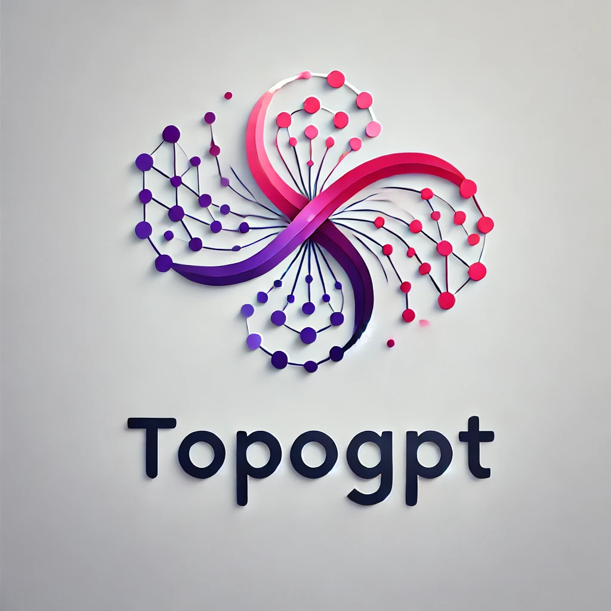

# Topogpt  
*An advanced tool leveraging large language models for solving scientific problems in topological materials.*

## Introduction
**topogpt** is a project focused on building a domain-specific large model for the field of topological materials. Compared to other fields like law or healthcare, the domain of topological materials is much more complex, filled with intricate concepts. Therefore, building a domain-specific large model can better serve this field. 

The research questions we aim to address include:

  - **How to acquire domain-specific knowledge and systematically transform it into high-quality training datasets suitable for large language models.**

  - **How to design and implement an objective, rigorous, and unbiased automated evaluation framework to assess the quality and performance of outputs generated by large language models.**

  - **How to develop more effective and efficient training methodologies to enhance the scalability and optimization of large language model training processes.**

  - **How to leverage large language models to assist domain experts and researchers in solving complex scientific problems, thereby extending their capabilities beyond conventional knowledge-based question-and-answer tasks.**

## **Code Overview**

- **agent**  
  Contains scripts and tools to develop agent-based models or automation pipelines for task execution and complex workflows.

- **annotation_system**  
  Includes tools for data quality improvement and annotation, particularly useful for reinforcement learning with human feedback (RLHF). Key functionalities include:  
  - **Prompt Evolution**: Enhances dataset complexity through iterative prompt rewriting.  
  - **Data Quality Classification**: Evaluates outputs to determine clarity, accuracy, and informativeness.  
  - **RLHF Ranking**: Provides tools to compare and rank outputs, creating preference-based datasets.

- **data_workflow**  
  Scripts designed to manage and preprocess data pipelines required for model pretraining, fine-tuning, and evaluation. This includes data cleaning, formatting, and sharding.

- **deploy**  
  Focused on deploying machine learning models using **vLLM**, which offers significant throughput advantages over traditional tools like FastAPI or Flask due to its Ray-based architecture. The deployment structure includes:  
  - **vllm_deploy.slurm**: SLURM script for batch deployment on HPC environments.  
  - **web_demo.py**: A web-based Gradio interface for real-time model interaction.  
  - **openai_chat_test.py**: A command-line test client to validate and interact with deployed models.

- **evaluate**  
  Contains tools for evaluating model performance on specific tasks or benchmarks, ensuring rigorous analysis and reporting.

- **images**  
  Directory for storing static visual assets, including diagrams, figures, and model architecture illustrations for documentation purposes.

- **model_manage**  
  Manages model inference workflows, resource allocation, and large-scale model deployment. Includes utilities for efficient handling of complex models like LLaMA, Qwen, and other state-of-the-art architectures.

- **tokenizer**  
  Dedicated to tokenizer training, merging, and evaluation, focusing on domain-specific vocabularies.  
  - **merge_tokenizer.py**: Merges custom tokenizers with pretrained models.  
  - **train_tokenizer.py**: Trains a new tokenizer using unigram or BPE algorithms on specialized datasets.  
  - **token_eff_test.py**: Tests tokenizer efficiency, including tokenization speed and compression ratios.  
  - **vocab.txt**: Outputs the vocabulary generated during tokenizer training for further inspection.

- **train**  
  The core training framework for pretraining and fine-tuning models:  
  - **Pretraining**: Scripts to train models from scratch on domain-specific datasets.  
  - **Fine-Tuning**: Scripts incorporating **LoRA** and **Supervised Fine-Tuning (SFT)** techniques to enhance model performance on specialized tasks.  
  - **RLHF Training**: Tools and scripts for **Reinforcement Learning with Human Feedback (RLHF)** to align models with human preferences through preference-based ranking and reward modeling.  

## To Do
- Currently, V1 of the project only includes part of the code. The complete source code will be released after the paper is finalized.

---

